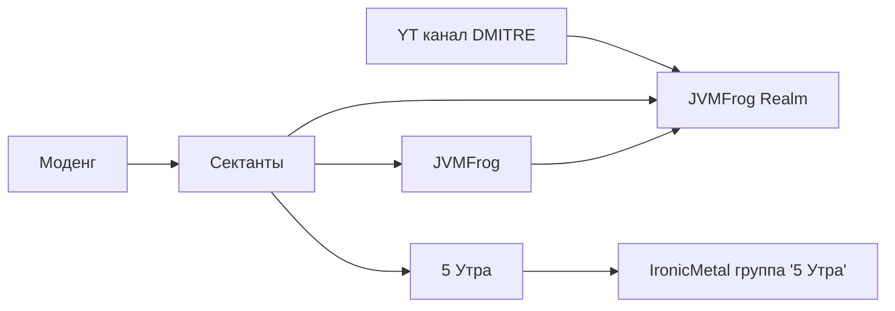

# Моденг: история о жабе

© Kirbo

> Любые разговоры о программировании приводят к моденгу

> У моденга такая история, что можно книгу писать

> Чаще всего скучно, потому что скучно

© intbyte

> Гредл - величайшее изобретение человечества

> ООП это святое

> gcc is gnu curve compiler

## Главы
1. Начало

 
